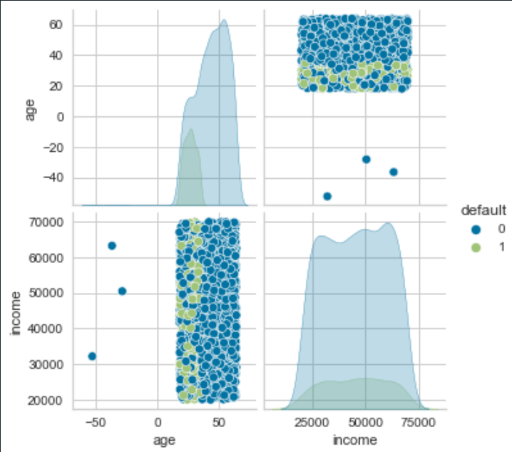
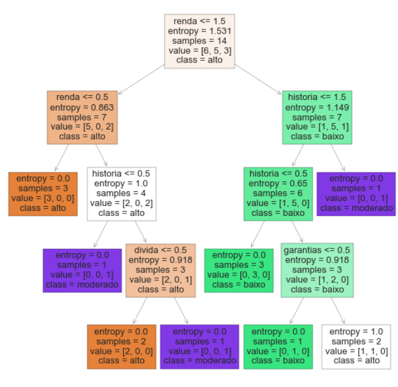
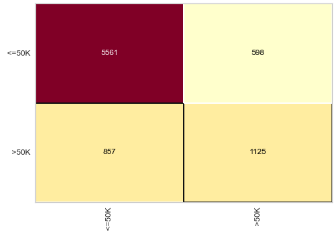
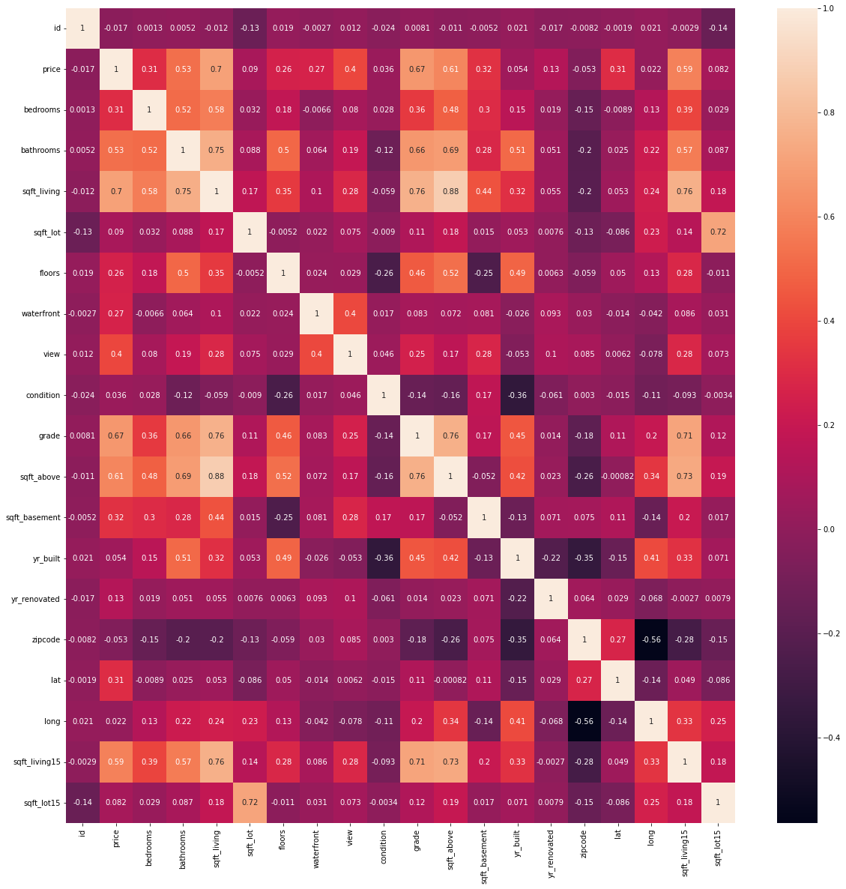
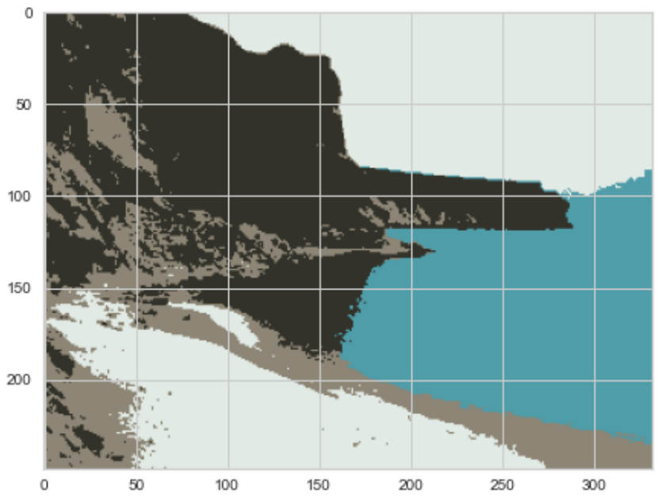
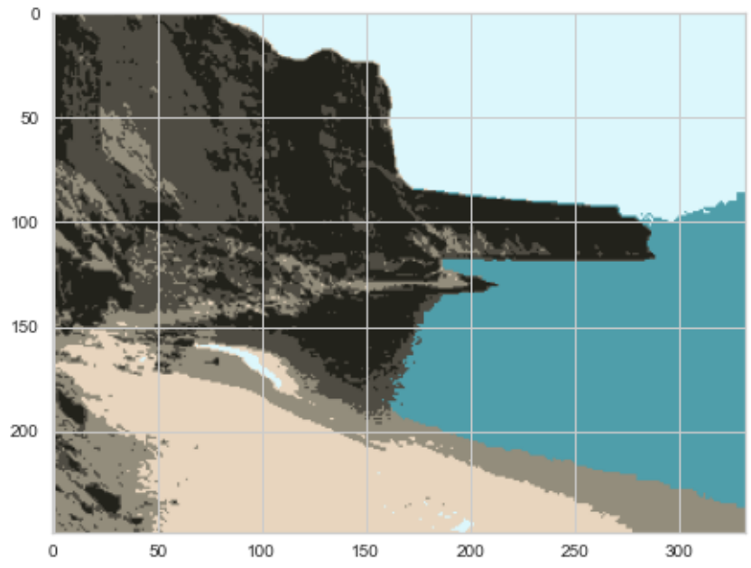
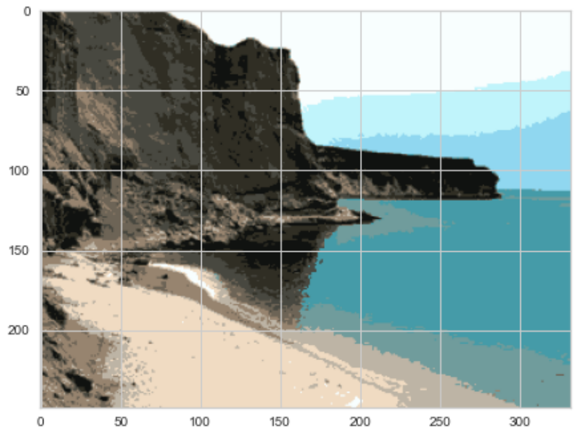
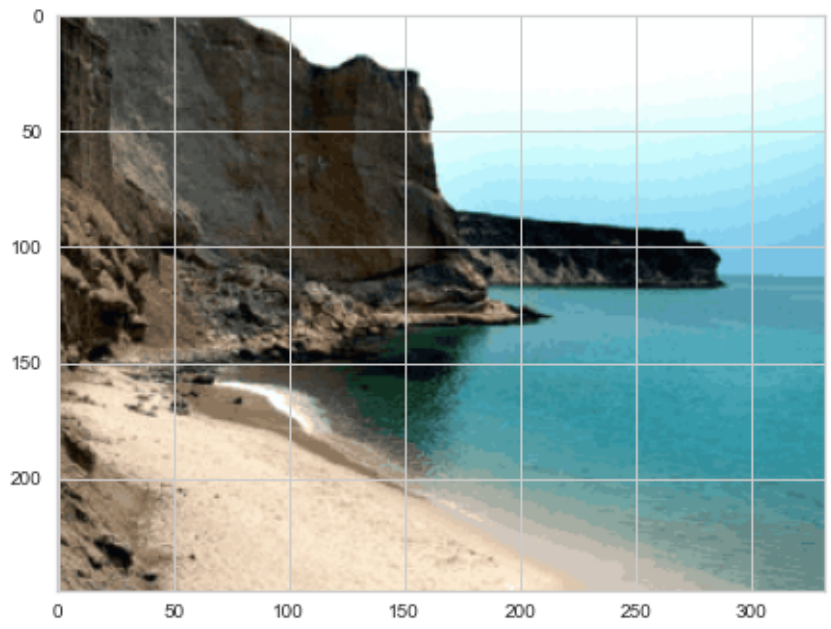
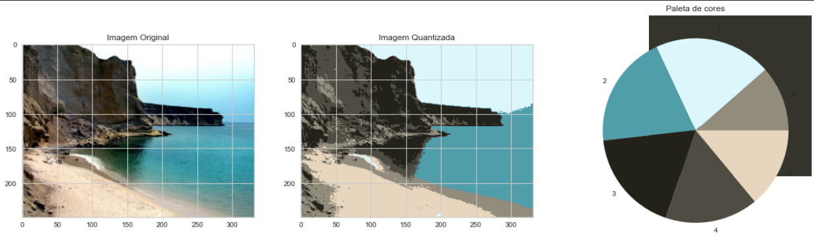
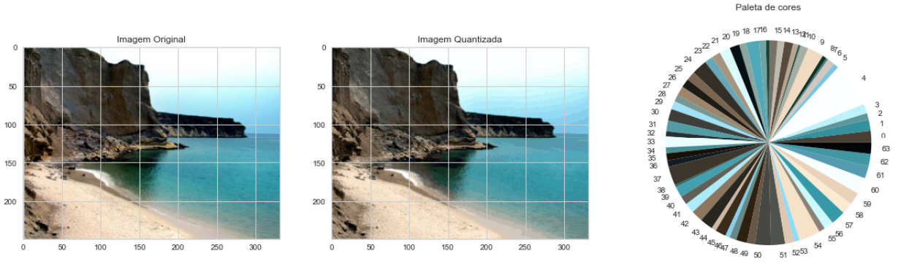

# Introduction to Artificial Intelligence

In this repository I put into practice all the activities developed in class. It is subdivided into folders and in each of them I address different topics on the same subject: Artificial Intelligence.

## Classification
### Topics
- Pandas
- Preprocessing
- Normalization
- Metrics
- Encoder
- OneHotEncoder
- Train Test Split
- Confusion Matrix

### Algorithms
  - Naive Bayes
  - Decision Tree
  - Random Forest
  - KNN
  - SVM
  - Neural Network

### Images

## Regression
### Topics
- Pandas
- Heat Map
- Train Test Split
- Plotly.express
- Metrics

### Algorithms
- Linear Regression
- Polynomial Features
- Decision Tree Regressor
- Random Forest Regressor
- SVR

### Images

## Clustering
### Topics
- Numpy
- Matplotlib.image
- KMeans++

### Algorithms
- KMeans

### Images

Source Image

4 Colors
)

6 Colors

12 Colors

64 Colors

6 Colors with Source Image

64 Color with Source Image
